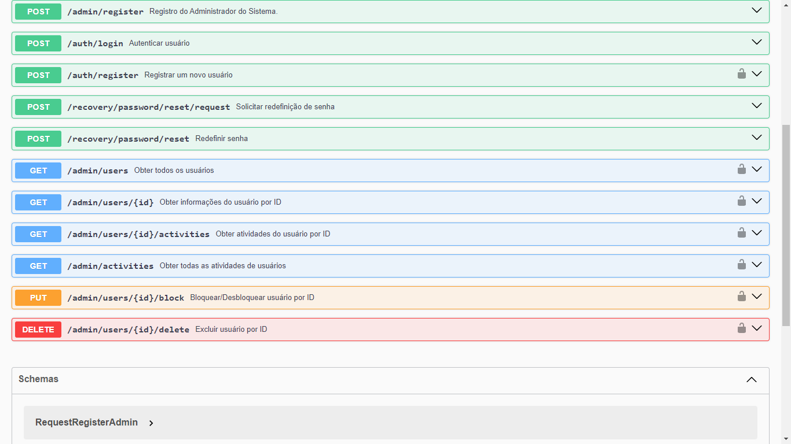

# Sistema de Gerenciamento de Senhas Corporativas
## Visão Geral
Sistema de gerenciamento de usuários com funcionalidades como registro, autenticação, recuperação de senha, e administração de usuários. Ele foi desenvolvido utilizando Node.js, Express.js, Sequelize (ORM para interação com banco de dados MySQL), e outras tecnologias relacionadas.

## Tecnologias Utilizadas

- **body-parser**: Facilita o manuseio dos dados recebidos nas solicitações HTTP, simplificando a interação com o corpo das requisições.

- **cors**: Habilitado para assegurar a segurança no acesso a recursos do servidor de diferentes origens, fundamental para prevenir vulnerabilidades de segurança.

- **dotenv**: Utilizado para carregar variáveis de ambiente a partir de um arquivo .env, contribuindo para a configuração flexível e segura do ambiente de desenvolvimento.

- **express**: Framework principal para a construção do servidor web, escolhido pela sua simplicidade e robustez, fornecendo uma base sólida para o desenvolvimento do projeto.

- **joi**: Essencial para validar dados de entrada, garantindo que apenas informações válidas e seguras sejam processadas pelo sistema.

- **jsonwebtoken**: Implementado para fornecer autenticação e autorização seguras por meio de tokens, uma abordagem eficaz para proteger rotas e recursos sensíveis.

- **morgan**: Adicionado para gerar logs de requisições HTTP, facilitando o monitoramento e a depuração do sistema durante o desenvolvimento e em produção.

- **mysql2**: Driver MySQL para interação eficiente com o banco de dados, escolhido com base na necessidade específica de integração com o MySQL.

- **nodemailer**: Utilizado para envio de e-mails, uma funcionalidade comum em muitos sistemas para notificações e comunicações com os usuários.

- **nodemon**: Ferramenta para reiniciar automaticamente o servidor durante o desenvolvimento, melhorando a eficiência e a produtividade dos desenvolvedores.

- **sequelize**: Escolhido como ORM para interagir com o banco de dados MySQL, proporcionando uma abstração fácil de usar para operações de banco de dados e simplificando o desenvolvimento.

- **sequelize-cli**: Ferramenta de linha de comando para Sequelize, facilita a execução de tarefas relacionadas ao banco de dados durante o desenvolvimento.

- **swagger-ui-express**: Interface Swagger para visualizar e interagir com a documentação da API, facilitando a compreensão e o uso da API pelos desenvolvedores.

## Fluxo do Sistema

### 1. Registro de Usuário
- Rota: `/auth/register` (POST)
- Controlador: `registerControllers.register`
- Descrição: Registra um novo usuário no sistema.
- Autenticação: Somente administradores têm acesso a essa rota.

### 2. Login de Usuário
- Rota: `/auth/login` (POST)
- Controlador: `loginControllers.login`
- Descrição: Autentica um usuário no sistema.


### 3. Solicitação de Redefinição de Senha
- Rota: `/recovery/password/reset/request` (POST)
- Controlador: `recoveryControllers.requestPasswordReset`
- Descrição: Solicita a redefinição de senha, enviando um e-mail com um token de recuperação.

### 4. Redefinição de Senha
- Rota: `/recovery/password/reset` (POST)
- Controlador: `recoveryControllers.resetPassword`
- Descrição: Redefine a senha usando um token de recuperação.

## Administração

### 5. Registro de Administrador
- Rota: `/admin/register` (POST)
- Controlador: `registerAdminControllers.register`
- Descrição: Registra um novo administrador no sistema.

### 6. Obter Todos os Usuários
- Rota: `/admin/users` (GET)
- Controlador: `adminControllers.getUsers`
- Descrição: Obtém todos os usuários no sistema (apenas para administradores).
- Autenticação: Somente administradores têm acesso a essa rota.

### 7. Obter Informações de Usuário Específico
- Rota: `/admin/users/:id` (GET)
- Controlador: `adminControllers.getUserId`
- Descrição: Obtém informações sobre um usuário específico (apenas para administradores).
- Autenticação: Somente administradores têm acesso a essa rota.

### 8. Obter Atividades de Usuário Específico
- Rota: `/admin/users/:id/activities` (GET)
- Controlador: `adminControllers.getUserActivities`
- Descrição: Obtém as atividades de um usuário específico (apenas para administradores).
- Autenticação: Somente administradores têm acesso a essa rota.

### 9. Obter Todas as Atividades de Usuários
- Rota: `/admin/activities` (GET)
- Controlador: `adminControllers.getActivityUsers`
- Descrição: Obtém todas as atividades de usuários (apenas para administradores).
- Autenticação: Somente administradores têm acesso a essa rota.

### 10. Bloquear ou Desbloquear Usuário
- Rota: `/admin/users/:id/block` (PUT)
- Controlador: `adminControllers.updateUsers`
- Descrição: Bloqueia ou desbloqueia um usuário (apenas para administradores).
- Autenticação: Somente administradores têm acesso a essa rota.

### 11. Excluir Usuário
- Rota: `/admin//users/:id/delete` (DELETE)
- Controlador: `adminControllers.deleteUser`
- Descrição: Exclui um usuário do sistema (apenas para administradores).
- Autenticação: Somente administradores têm acesso a essa rota.


## Como Iniciar

Siga as etapas abaixo para iniciar o projeto em sua máquina local:

1. Clonar o repositório:

`
  https://github.com/CarlosSoares123/Gerenciamento_Senhas_Corporativas.git
`

2. Crie um arquivo `.env` na raiz do projeto e adicione as variáveis de ambiente necessárias, como chaves de API, configurações de banco de dados . Certifique-se de incluir as seguintes variáveis para configurar a conexão com o banco de dados:

```bash
DB_USERNAME=seu-host

DB_PASSWORD=sua-senha

DB_DATABASE=banco-de-dados

DB_HOST=127.0.0.1

```

3. Acessar o diretório do banco de dados:

  `
  cd database
  `

4. Executar as migrações do banco de dados:

`
  npx sequelize-cli db:migrate
`

`
  cd ..
`

5. Instalar as dependências:

`
  npm install
`

6. Inicie o servidor:

`
npm run dev
`

## Uso da API

Acesse a documentação Swagger em http://localhost:5000/api-docs para explorar e interagir com os endpoints da API.



